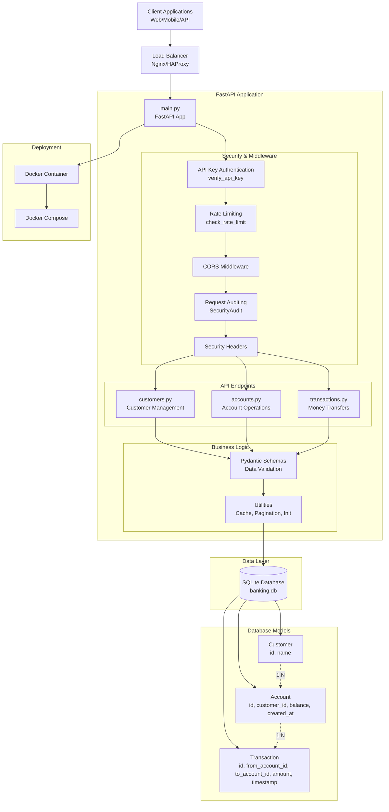
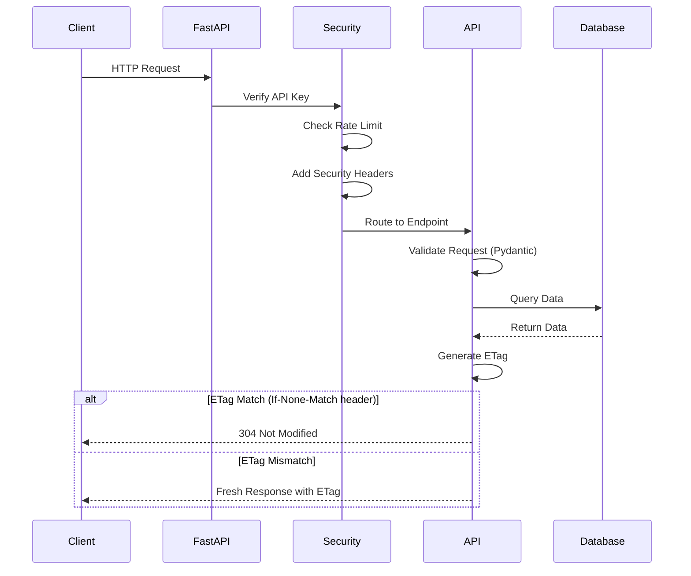

# Banking API

## System Architecture Overview

## API Flow Architecture

## Key Architecture Components

### 1. **FastAPI Application** (`main.py`)
- Main application entry point
- CORS middleware configuration
- Router registration with security dependencies
- Application lifespan management

### 2. **Security Layer** (`utils/security_deps.py`)
- API key authentication via `X-API-Key` header
- Rate limiting per IP address
- Security headers injection
- Request auditing and logging

### 3. **API Endpoints**
- **Customers** (`api/customers.py`): Customer CRUD operations
- **Accounts** (`api/accounts.py`): Account management with mobile optimizations
- **Transactions** (`api/transactions.py`): Money transfer operations

### 4. **Data Models** (`models/`)
- **SQLAlchemy Models** (`models.py`): Database schema definitions
- **Pydantic Schemas** (`schemas.py`): API request/response validation

### 5. **Database Layer** (`database.py`)
- SQLite for development (with PostgreSQL async support)
- Session management with dependency injection
- Connection pooling and lifecycle management

### 6. **Utilities** (`utils/`)
- **Cache** (`cache.py`): ETag-based HTTP caching for mobile optimization
- **Pagination** (`pagination.py`): Cursor-based pagination
- **Database Init** (`init_db.py`): Database initialization and seeding

### 7. **Deployment**
- Docker containerization
- Docker Compose for orchestration
- Environment-based configuration

## Key Features

### Security
- API key authentication
- Rate limiting
- Security headers
- Request auditing
- CORS protection

### Performance
- ETag-based HTTP caching (client-side)
- Response customization
- Resource expansion
- Cursor-based pagination

### Scalability
- Async database support
- Connection pooling
- Stateless design
- Containerized deployment
