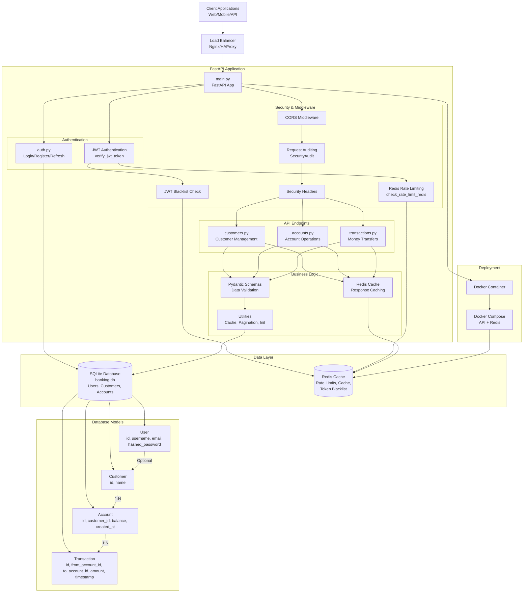
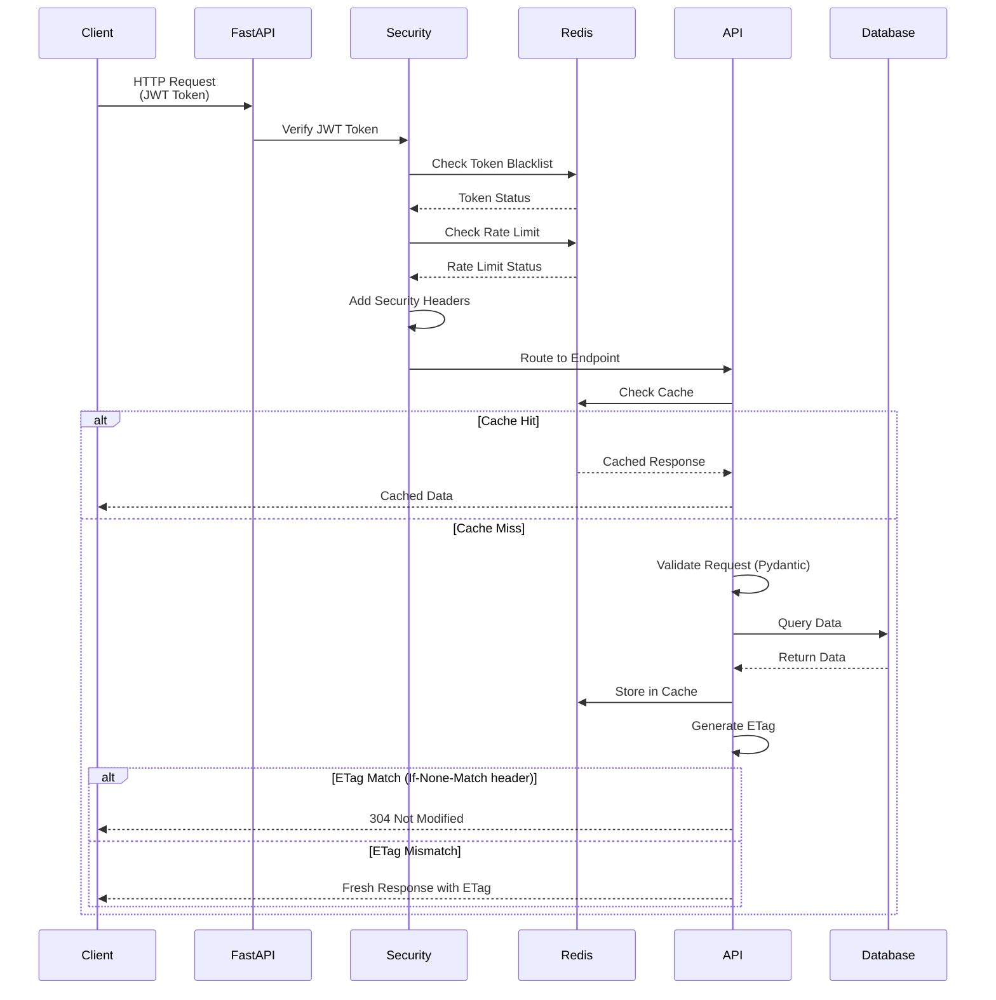

# Banking API

## System Architecture Overview

```mermaid
graph TB
    %% External Layer
    Client[Client Applications<br/>Web/Mobile/API]
    
    %% Load Balancer/Reverse Proxy
    LB[Load Balancer<br/>Nginx/HAProxy]
    
    %% Application Layer
    subgraph "FastAPI Application"
        Main[main.py<br/>FastAPI App]
        
        %% Authentication Layer
        subgraph "Authentication"
            JWTAuth[JWT Authentication<br/>verify_jwt_token]
            AuthRouter[auth.py<br/>Login/Register/Refresh]
        end
        
        %% Security Layer
        subgraph "Security & Middleware"
            RateLimit[Redis Rate Limiting<br/>check_rate_limit_redis]
            TokenBlacklist[JWT Blacklist Check]
            CORS[CORS Middleware]
            Audit[Request Auditing<br/>SecurityAudit]
            Headers[Security Headers]
        end
        
        %% API Layer
        subgraph "API Endpoints"
            CustomerAPI[customers.py<br/>Customer Management]
            AccountAPI[accounts.py<br/>Account Operations]
            TransactionAPI[transactions.py<br/>Money Transfers]
        end
        
        %% Business Logic Layer
        subgraph "Business Logic"
            Schemas[Pydantic Schemas<br/>Data Validation]
            Utils[Utilities<br/>Cache, Pagination, Init]
            RedisCache[Redis Cache<br/>Response Caching]
        end
    end
    
    %% Data Layer
    subgraph "Data Layer"
        DB[(SQLite Database<br/>banking.db<br/>Users, Customers, Accounts)]
        Redis[(Redis Cache<br/>Rate Limits, Cache,<br/>Token Blacklist)]
    end
    
    %% Database Models
    subgraph "Database Models"
        UserModel[User<br/>id, username, email,<br/>hashed_password]
        CustomerModel[Customer<br/>id, name]
        AccountModel[Account<br/>id, customer_id, balance, created_at]
        TransactionModel[Transaction<br/>id, from_account_id, to_account_id, amount, timestamp]
    end
    
    %% Deployment
    subgraph "Deployment"
        Docker[Docker Container]
        Compose[Docker Compose<br/>API + Redis]
    end
    
    %% Connections
    Client --> LB
    LB --> Main
    Main --> JWTAuth
    Main --> AuthRouter
    JWTAuth --> TokenBlacklist
    TokenBlacklist --> Redis
    JWTAuth --> RateLimit
    RateLimit --> Redis
    AuthRouter --> DB
    Main --> CORS
    CORS --> Audit
    Audit --> Headers
    Headers --> CustomerAPI
    Headers --> AccountAPI
    Headers --> TransactionAPI
    
    CustomerAPI --> RedisCache
    AccountAPI --> RedisCache
    TransactionAPI --> RedisCache
    RedisCache --> Redis
    
    CustomerAPI --> Schemas
    AccountAPI --> Schemas
    TransactionAPI --> Schemas
    
    Schemas --> Utils
    Utils --> DB
    
    DB --> UserModel
    DB --> CustomerModel
    DB --> AccountModel
    DB --> TransactionModel
    
    UserModel -.->|Optional| CustomerModel
    CustomerModel -.->|1:N| AccountModel
    AccountModel -.->|1:N| TransactionModel
    
    Main --> Docker
    Docker --> Compose
    Compose --> Redis
```

## API Flow Architecture

```mermaid
sequenceDiagram
    participant Client
    participant FastAPI
    participant Security
    participant Redis
    participant API
    participant Database
    
    Client->>FastAPI: HTTP Request<br/>(JWT Token)
    FastAPI->>Security: Verify JWT Token
    Security->>Redis: Check Token Blacklist
    Redis-->>Security: Token Status
    Security->>Redis: Check Rate Limit
    Redis-->>Security: Rate Limit Status
    Security->>Security: Add Security Headers
    Security->>API: Route to Endpoint
    API->>Redis: Check Cache
    alt Cache Hit
        Redis-->>API: Cached Response
        API-->>Client: Cached Data
    else Cache Miss
        API->>API: Validate Request (Pydantic)
        API->>Database: Query Data
        Database-->>API: Return Data
        API->>Redis: Store in Cache
        API->>API: Generate ETag
        alt ETag Match (If-None-Match header)
            API-->>Client: 304 Not Modified
        else ETag Mismatch
            API-->>Client: Fresh Response with ETag
        end
    end
```

## Key Architecture Components

### 1. **FastAPI Application** (`main.py`)
- Main application entry point
- CORS middleware configuration
- Router registration with security dependencies
- Application lifespan management
- Redis connection initialization and cleanup

### 2. **Authentication Layer** (`api/auth.py`)
- User registration and login endpoints
- JWT token generation and validation
- Token refresh mechanism
- Logout with token blacklisting
- User profile endpoint (`/api/auth/me`)

### 3. **Security Layer** (`utils/security_deps.py`)
- JWT authentication via `Authorization: Bearer <token>` header (required for all endpoints)
- Redis-based rate limiting per user (identified by user ID from JWT token)
- Security headers injection
- Request auditing and logging
- Token blacklist checking

### 4. **API Endpoints**
- **Authentication** (`api/auth.py`): User registration, login, token management
- **Customers** (`api/customers.py`): Customer CRUD operations
- **Accounts** (`api/accounts.py`): Account management with mobile optimizations
- **Transactions** (`api/transactions.py`): Money transfer operations

### 5. **Data Models** (`models/`)
- **SQLAlchemy Models** (`models.py`): Database schema definitions
  - `User`: User authentication model (username, email, hashed_password)
  - `Customer`: Customer information
  - `Account`: Bank account details
  - `Transaction`: Money transfer records
- **Pydantic Schemas** (`schemas.py`): API request/response validation
  - Authentication schemas (UserCreate, UserLogin, Token, TokenData)
  - Business entity schemas (Customer, Account, Transaction)

### 6. **Database Layer** (`database.py`)
- SQLite for development (with PostgreSQL async support)
- Session management with dependency injection
- Connection pooling and lifecycle management
- User table initialization

### 7. **JWT Utilities** (`utils/jwt_utils.py`)
- JWT access token generation (short-lived)
- JWT refresh token generation (long-lived)
- Token verification and validation
- User extraction from tokens
- Token expiration handling

### 8. **Redis Utilities** (`utils/redis_*.py`)
- **Redis Client** (`redis_client.py`): Connection management and lifecycle
- **Redis Cache** (`redis_cache.py`): API response caching with user-specific keys
- **Redis Rate Limit** (`redis_rate_limit.py`): Sliding window rate limiting
- **Redis Token Store** (`redis_token_store.py`): Token blacklist and refresh token management

### 9. **Utilities** (`utils/`)
- **Cache** (`cache.py`): ETag-based HTTP caching for mobile optimization
- **Pagination** (`pagination.py`): Cursor-based pagination
- **Database Init** (`init_db.py`): Database initialization and seeding

### 10. **Deployment**
- Docker containerization
- Docker Compose for orchestration (API + Redis services)
- Environment-based configuration
- Redis persistence with volume mounting

## Key Features

### Security
- **JWT Authentication**: User-based authentication with access and refresh tokens (required for all endpoints)
- **Token Blacklisting**: JWT tokens blacklisted on logout using Redis
- **Redis-based Rate Limiting**: Distributed rate limiting per user with sliding window algorithm
- **Security Headers**: Standard security headers on all responses
- **Request Auditing**: Comprehensive logging of all API operations
- **CORS Protection**: Configurable CORS middleware

### Performance
- **Redis Caching**: Server-side response caching with user-specific cache keys
  - Account data: 60 seconds TTL
  - Transaction data: 30 seconds TTL
  - Automatic cache invalidation on mutations
- **ETag-based HTTP Caching**: Client-side caching with conditional requests
- **Response Customization**: Minimal/full detail levels for optimized payloads
- **Resource Expansion**: Related resources in single requests
- **Cursor-based Pagination**: Efficient pagination for large datasets

### Scalability
- **Redis Integration**: Distributed caching and rate limiting
- **Async Database Support**: PostgreSQL async support for high concurrency
- **Connection Pooling**: Efficient database connection management
- **Stateless Design**: JWT-based stateless authentication
- **Containerized Deployment**: Docker and Docker Compose orchestration
- **Horizontal Scaling**: Redis enables multi-instance deployments
